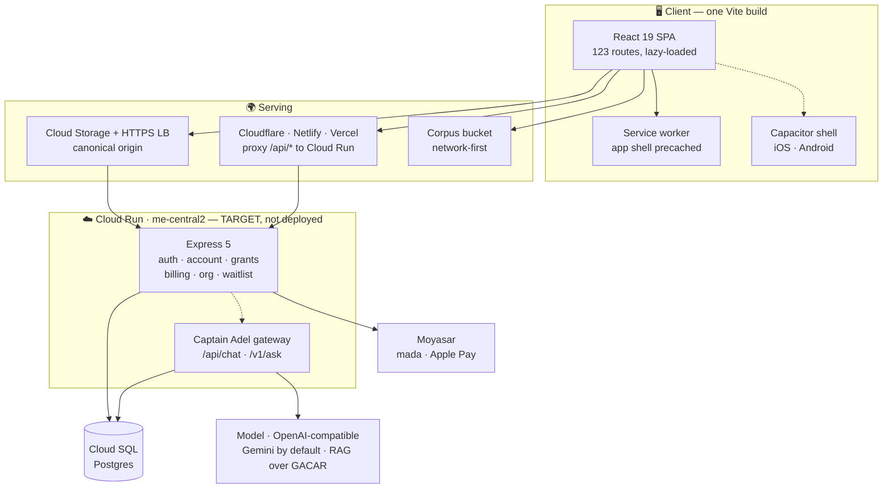

<div align="center">


# Fly GACA ✈️

### The independent flight deck for Saudi civil aviation

**find it · study it · always verify against GACA**

<p>
  
</p>

<p>
  <a href="../../actions/workflows/ci.yml"></a>
  
  
  
  <a href="LICENSE"></a>
</p>

<p>
  
  
  
  
  
  
</p>


</div>

> [!IMPORTANT]
> **Fly GACA is not affiliated with GACA.** It helps you *find and study* regulation — it never replaces it. Every answer cites the exact Part and section, and every surface repeats one rule: **verify against the latest official GACA publication.**

---

## What it is

The Saudi regulatory corpus, made searchable — plus the tools you'd otherwise keep in a different app, a different tab, and a paper notebook.

|  | |
|---|---|
| 📚 **Regulatory library** | 74 GACAR Parts and 211 reference documents, full-text searchable, deep-linkable to the section. Offline-capable. |
| <br />🤖 **Captain Adel** | RAG over the corpus, generated over an OpenAI-compatible endpoint (**Gemini** by default; provider is config, so an in-Kingdom ALLaM is a drop-in swap). Answers cite the Part/section they came from, and refuse when retrieval comes up empty. |
| 🧮 **55+ flight tools & Live NOAA Wx** | Real-time NOAA METAR/TAF weather feed for 61 Saudi aerodromes (`OE**`), flight categories (`VFR/MVFR/IFR/LIFR`), runway crosswind resolvers, ISA, TAS, holding entries, runway performance, weight & balance. |
| 🛂 **License conversion wizard** | Interactive 5-step GACAR Part 61/67 foreign license conversion pathway calculator (FAA, EASA, UK CAA, ICAO → GACA PPL/CPL/ATPL). |
| 🏫 **Flight school admin dashboard** | Real-time cohort health score, weak-area analytics by GACAR subject, cadet drill-down modal, and stage-check readiness tracking for Part 141 ATOs. |
| 📱 **iPadOS EFB cockpit mode** | Red-light night vision theme (`data-cockpit-mode="red"`), floating cockpit bar with live UTC/Zulu clock, emergency frequencies (`121.500 MHz` / squawk `7500/7600/7700`), and screen wake-lock. |
| 🧾 **ZATCA Phase 2 e-invoicing** | Production UBL 2.1 XML generation, SHA-256 canonical hashing, and Phase 2 TLV QR code encoding for B2B flight academy billing. |
| 🎓 **Study** | 1,000 questions across 26 banks, flashcards with spaced repetition, ground school, timed mock exams, and per-certificate prep packs. |
| 🛩️ **Logbook & currency** | Flights, landings, ratings and medicals — with the calendar-month maths the regulation actually specifies. |
| 🌐 **Bilingual, RTL-first** | English ⇄ Arabic across every surface, with the whole route tree mirrored under `/ar`. |

<div align="center">


<sub><i>The left seat — where every rule earns its keep.</i></sub>
</div>

---

## Where this is

Fly GACA is **pre-launch**, and the README says so in the same words the engineering docs
do — a diligence process finds the deployment state in an afternoon, so there is nothing to
gain by writing it any other way.

**What exists and works today:** the whole product, locally and in CI. The corpus, the
library, the 55 tools, study, the logbook, Captain Adel's retrieval and grounding, billing
logic, entitlements, the B2B dashboard — all built, all tested, all bilingual.

**What is not true yet:**

| | |
|---|---|
| 🌐 **flygaca.com is down** | The domain serves a Firebase "Site Not Found" on every path — the apex TXT record still names the old Hosting site. The build itself is healthy and current. |
| ☁️ **Nothing is deployed** | The Express service in `server/` has never run in production. The live remnants are the previous Firebase Functions stack. |
| 🇸🇦 **Data is not in-Kingdom** | `me-central2` (Dammam) is the target for PDPL residency and is **not granted to this account**. The blocker is commercial, not technical — see below. |
| 👥 **There are no users** | No production datastore holds user data. Any traction figure for this platform would be a projection, so none appears here. |

**The residency blocker, precisely.** Dammam is sold **only through CNTXT**, Google's
exclusive KSA reseller, to registered **organizations** on Invoiced Billing; individuals get
an open-ended waiting list. So it needs a KSA legal entity and a billing migration — a
corporate step, not an engineering one. Measured from Riyadh, Dammam would be 17 ms away;
the fastest region actually available is Milan at 83 ms. **No available fallback is
in-Kingdom, so the in-Kingdom claim is made nowhere in the product** — the privacy notice
states the opposite, correctly, and names the actual regions.

### What is genuinely defensible

Not traction — engineering and content depth, both verifiable from this repository in
minutes:

| | |
|---|---|
| 📋 **The corpus** | 74 GACAR Parts and 211 reference documents, indexed, full-text searchable and deep-linkable to the section. This is the moat, and it is real and committed. |
| 🧪 **2,388 tests** | Across the frontend and the API, with a coverage ratchet that fails the build on regression, an e2e/a11y suite, and parity tests that pin client mirrors to their server cores. |
| 🔒 **Entitlements are structural** | There is simply **no route** that lets a client write its own plan, credits or pack ownership. Grants only ever upgrade. Enforcement lives in the gateway, never the app. |
| 🌍 **Bilingual to the URL** | Every route has an `/ar` twin, RTL via logical properties, and CI fails on any i18n key present in one language but not the other. Not a translation layer bolted on. |
| 🧮 **Pure, testable math** | 55 calculators as DOM-free modules, state in the URL so any result is a shareable link. |
| 🔁 **Provider independence** | Captain Adel generates over an OpenAI-compatible endpoint chosen by config. Swapping Gemini for an in-Kingdom ALLaM is an env change, not a rewrite — which is what makes the residency fix tractable once the region is granted. |

Commercial material — the model, pricing and projections — lives in `ay2m/Office` under
`09-investor-relations/`, access-controlled, where it belongs. This file is for engineers.

---

## Quick start

**Node 24** (`engines` in `package.json`; CI runs the same). No backend needed — with no API configured the app runs entirely local-first out of `localStorage`.

```bash
git clone https://github.com/ay2m/FlyGACA.git
cd FlyGACA && npm install
npm run dev                     # → http://localhost:5173
```

That's the whole loop. The regulatory corpus ships in `public/data/`, so search, tools, study and the library all work offline on first run.

<details>
<summary><b>Running the API too</b> (auth, billing, Captain Adel, the B2B dashboard)</summary>

```bash
npm install --prefix server
cp .env.example .env            # DATABASE_URL, SESSION_SECRET, PRICE_* …

docker run -d --name flygaca-pg -e POSTGRES_PASSWORD=postgres \
  -e POSTGRES_DB=flygaca -p 5432:5432 postgres:17-alpine
node --env-file=.env server/scripts/migrate.mjs

npm run server:dev              # → http://localhost:8080
```

With `MAIL_API_KEY` empty, verification and reset emails print to the server log instead of sending — so sign-up works end to end offline.

</details>

---

## Architecture



**The shape of it.** Business rules live in pure, dependency-free `*-core.ts` modules so policy is unit-testable in isolation; the Express routes stay thin and all SQL sits in one file. Calculator math is DOM-free in `src/calc/`, one module per tool. The heavy corpus (114 MB) never enters the JS bundle — it's fetched at runtime and served network-first from a bucket. Entitlements are server-owned: there is simply no route that lets a client write its own plan.

**Two Captain Adels, one contract.** This repo implements Captain Adel in `server/src/`
(`captain-adel.ts` + `corpus.ts` + `grounding-core.ts`); the sibling repo `ay2m/Captain-Adel`
implements it again for captadel.com. They are parallel implementations, not one brain shared —
older docs in both repos claimed otherwise and were wrong. What they genuinely share is pinned in
[`contracts/flygaca-family.json`](contracts/flygaca-family.json) and asserted by
`tests/family-contract.test.ts` in CI. `server/src/brain.ts` is the seam where consolidating them
would happen: it resolves to the local flow unless `ADEL_REMOTE_BASE_URL` is set, which it is on no
revision. The cost of flipping it — chiefly that the two decide grounding at different points in
the request — is specced in [`docs/DESIGN-brain-consolidation.md`](docs/DESIGN-brain-consolidation.md).

**Where it actually runs.** The diagram above is the target. Nothing in the `api` box is
deployed: the live remnants are the previous Firebase Functions stack in `me-central1` (Doha),
with the billed project's Firestore in `us-central1` (Iowa) and Cloud SQL in `us-east4`
(Northern Virginia). The `me-central2` blocker is covered under [Where this is](#where-this-is);
the full audit is the caution in [`CLAUDE.md`](CLAUDE.md#hosting--deploy).

---

## Commands

| | |
|---|---|
| `npm run dev` | Vite dev server, HMR |
| `npm run build` | sitemap → `tsc -b` → vite → prerender `<head>` → SEO gates |
| `npm run build:deploy` | **what a deploy runs**: `build` + full-body prerender + coverage gate + IndexNow |
| `npm run verify` | **the gate**: typecheck · lint · format · test · build · bundle + perf budgets |
| `npm test` / `npm run server:test` | 1,787 frontend · 605 server |
| `npm run test:e2e` | Playwright smoke + axe accessibility |
| `npm run server:dev` | API with watch-rebuild |
| `npm run sync:gaca` / `data:normalize` | pull and normalise the regulatory corpus |
| `npm run parse:regulations` | compile the cross-reference lookup |
| `npm run build:flavor -- <id>` | slice content for a single exam-prep app |

Run `npm run verify` before committing — it's the same chain CI would run.

---

## Deploy

> [!WARNING]
> Not yet runnable. `me-central2` is not available to the account, and this service has never
> been deployed — see [`docs/RUNBOOK-deploy.md`](docs/RUNBOOK-deploy.md).

```bash
# Google Cloud — the canonical origin. Full sequence in docs/RUNBOOK-deploy.md
npm run build:deploy                                   # NOT plain `build` — see below
npm run deploy:api                                     # build the image, roll out a Cloud Run revision
WEB_BUCKET=gs://… DATA_BUCKET=gs://… URL_MAP=… \
  npm run deploy:web                                   # publish dist/ + the corpus, stamp Cache-Control
```

Build the SPA with `npm run build:deploy`, not `npm run build`. Plain `build` stops at the
per-route `<head>` floor; `build:deploy` also renders each route's **body** (Playwright) and fails
if any sitemap URL is missing one. AI crawlers — the ones that decide who gets cited — mostly don't
execute JavaScript, so a head-only deploy is invisible to them below the `<head>`.

`npm run deploy` deliberately fails with a pointer to the runbook — deploying is two commands, not one.

> [!NOTE]
> Neither `--source .` nor `--source server/` can build the API. Cloud Run's source deploys only honour a Dockerfile at the **root** of the source directory, and ours is `server/Dockerfile` — which copies `public/data/rag-chunks.json` in, so it must build from the repo root with the corpus in context. `cloudbuild.yaml` does exactly that (`docker build -f server/Dockerfile .`) and `npm run deploy:api` drives it.

> [!WARNING]
> Prices come from `PRICE_*` env on the Cloud Run revision and have **no code defaults**. Change a price in the repo and you must update that revision in the same breath, or the site advertises one number and charges another. `tests/pricing-server-parity.test.ts` guards the repo half.


---

## Docs

| | |
|---|---|
| [`CLAUDE.md`](CLAUDE.md) | **Start here.** Architecture, conventions, and what's enforced. |
| [`docs/RUNBOOK-deploy.md`](docs/RUNBOOK-deploy.md) | Provisioning a fresh GCP project + the deploy sequence |
| [`docs/ARCHITECTURE-BLUEPRINT.md`](docs/ARCHITECTURE-BLUEPRINT.md) | Platform-wide technical blueprint |
| [`docs/BILLING.md`](docs/BILLING.md) · [`docs/LICENSED-API.md`](docs/LICENSED-API.md) | Checkout and the metered `/v1/ask` surface |
| [`docs/b2b/`](docs/b2b/) | Cohort dashboard, study-progress sync, curriculum |
| [`GUIDE_AUTHORING.md`](GUIDE_AUTHORING.md) · [`FIGMA_DESIGN_SYSTEM.md`](FIGMA_DESIGN_SYSTEM.md) | Writing guides · the Falcon design system |
| [`docs/DESIGN-brain-consolidation.md`](docs/DESIGN-brain-consolidation.md) | The two Captain Adel brains, and what merging them would cost |
| [`contracts/flygaca-family.json`](contracts/flygaca-family.json) | The cross-repo family contract — shared with `ay2m/Office` and `ay2m/Captain-Adel` |

Most of `docs/` was restored from this project's predecessor repo and predates the Cloud Run rebuild — those files carry a banner saying so. `CLAUDE.md` is the authority on how the system works today.

---

## The Fly GACA family

Everything lives under the **`ay2m`** account. This roster is the `repos` block of
[`contracts/flygaca-family.json`](contracts/flygaca-family.json) in prose — that file is the
machine-readable version, and it is committed byte-identically to all three active repos.

| Repo | | What it is |
|---|---|---|
| [`ay2m/FlyGACA`](https://github.com/ay2m/FlyGACA) | private | **This repo.** The web app and its Express backend, plus the regulatory corpus and content pipelines. |
| [`ay2m/Captain-Adel`](https://github.com/ay2m/Captain-Adel) | private | The standalone AI flight instructor behind captadel.com. |
| [`ay2m/Office`](https://github.com/ay2m/Office) | private | The operating-documents repo — strategy, governance, legal, finance, HR, GTM, brand. Owns the legal-entity facts this repo restates. |
| [`ay2m/FlyGACA-ios`](https://github.com/ay2m/FlyGACA-ios) | public | The native SwiftUI family — one App Store app per exam module. ELPT and AIP ship; PPL, CPL, IR and ATPL are parked. |
| [`ay2m/FlyGACA-app`](https://github.com/ay2m/FlyGACA-app) | archived | The retired predecessor of this repo, kept for its 1,005-commit history. Never cite it as current. |

There is no `FlyGACA/…` organisation and there are no per-module App Store repos — older
documents reference both, and every such path 404s.

---

## Contributing

Bilingual is not optional: new copy needs a key in **both** `src/i18n/en.json` and `ar.json` — the test suite fails on a key present in one and missing from the other. Styling uses design tokens and logical properties only, so RTL mirrors for free. The `<Disclaimer />` component is the single source of the not-affiliated text; never inline or reword it.

See [`CONTRIBUTING.md`](CONTRIBUTING.md), and [`SECURITY.md`](SECURITY.md) to report a vulnerability.

## License

[MIT](LICENSE). The regulatory content itself belongs to **GACA** and is reproduced for study — always verify against [gaca.gov.sa](https://gaca.gov.sa).

<div align="center">
<br />
<sub><b>Fly GACA</b> · an independent educational platform · not affiliated with the General Authority of Civil Aviation</sub>
<br />
<sub>صنع في السعودية 🇸🇦</sub>
</div>
