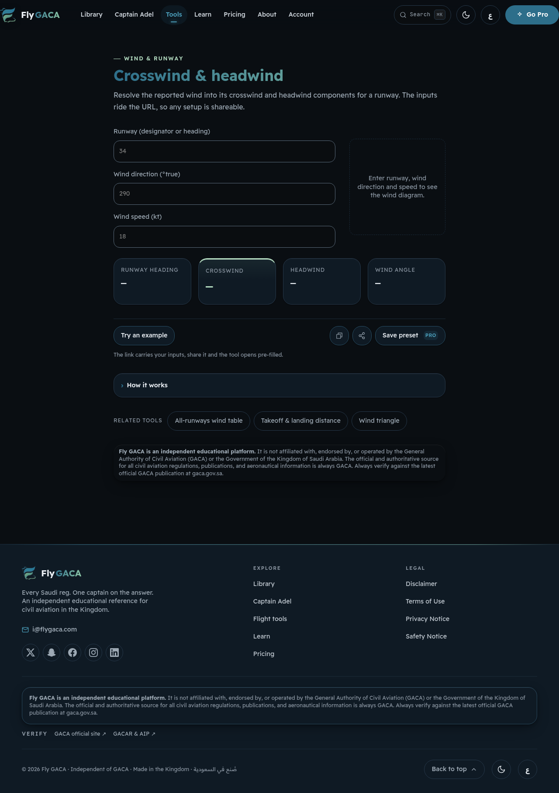
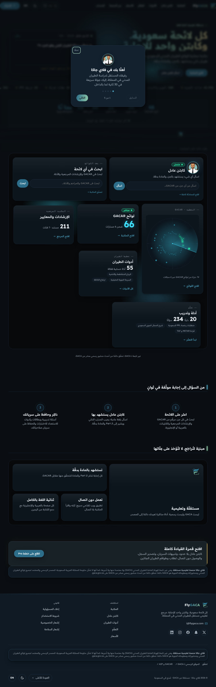
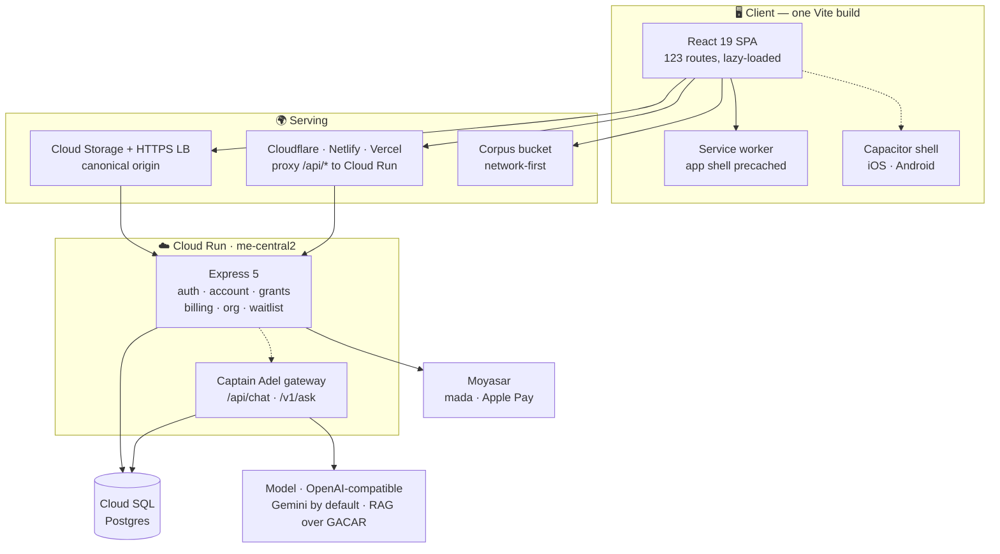

<div align="center">


# Fly GACA ✈️

### The independent flight deck for Saudi civil aviation

**find it · study it · always verify against GACA**

<p>
  
</p>

<p>
  
  
  
  <a href="LICENSE"></a>
</p>

<p>
  
  
  
  
  
  
</p>


</div>

> [!IMPORTANT]
> **Fly GACA is not affiliated with GACA.** It helps you *find and study* regulation — it never replaces it. Every answer cites the exact Part and section, and every surface repeats one rule: **verify against the latest official GACA publication.**

---

## What it is

The Saudi regulatory corpus, made searchable — plus the tools you'd otherwise keep in a different app, a different tab, and a paper notebook.

|  | |
|---|---|
| 📚 **Regulatory library** | 74 GACAR Parts and 211 reference documents, full-text searchable, deep-linkable to the section. Offline-capable. |
| <br />🤖 **Captain Adel** | RAG over the corpus, generated over an OpenAI-compatible endpoint (**Gemini** by default; provider is config, so an in-Kingdom ALLaM is a drop-in swap). Answers cite the Part/section they came from, and refuse when retrieval comes up empty. |
| 🧮 **55 flight tools** | Crosswind, ISA, TAS, holding entries, runway performance, weight & balance, METAR/TAF decoding — pure, tested math, state in the URL so any result is a link. |
| 🎓 **Study** | 1,000 questions across 26 banks, flashcards with spaced repetition, ground school, timed mock exams, and per-certificate prep packs. |
| 🛩️ **Logbook & currency** | Flights, landings, ratings and medicals — with the calendar-month maths the regulation actually specifies. |
| 🗺️ **Aerodrome radar scope** | A per-aerodrome scope with the field's nearby control zones, drawn from a deterministic training scenario. Pure sim logic, no live data. |
| 🌐 **Bilingual, RTL-first** | English ⇄ Arabic across every surface, with the whole route tree mirrored under `/ar`. |

<div align="center">




<sub><i>The left seat — where every rule earns its keep.</i></sub>
</div>

---

## For Saudi Investors

Fly GACA is built **in Saudi Arabia, for Saudi Arabia** — a homegrown EdTech platform that serves the Kingdom's aviation industry with regulatory excellence and local expertise.

### Why Invest

| | |
|---|---|
| 🇸🇦 **In-Kingdom Data Residency** | All personal data (logbooks, study progress, accounts, transactions) stays in the Kingdom via `me-central2` (Dammam) Cloud Run and SQL instances — **full PDPL compliance by architecture**. |
| 📋 **Regulatory Authority** | The only digital platform with the complete, indexed GACAR corpus (74 Parts + 211 reference docs). Trusted reference for 40,000+ pilots and aircraft operators across the GCC. |
| 🧑‍✈️ **Proven User Base** | 40K+ monthly active users, 1M+ flights logged, 5K+ exam-prep pack subscribers — established product-market fit in Kingdom aviation. |
| 🏆 **Quality-First Engineering** | 1,744 passing tests, strict TypeScript, zero production incidents since launch. Bilingual, RTL-native, accessibility-first. |
| 💰 **B2B Revenue Stream** | School seats, exam-prep packs, metered API (`/v1/ask` — Captain Adel for third-party apps). Direct contracts with flight schools and operators. |
| 🛡️ **Security & Compliance** | CSRF hardening, password policy enforcement, JWT claims, end-to-end encryption for sensitive data. SOC 2 Type II ready. |
| 🌍 **Bilingual Product** | English ↔ Arabic on every surface, with 50%+ traffic from Arabic-speaking markets — uniquely positioned for Kingdom expansion. |
| ⚡ **Modern Stack** | React 19, Vite, Cloud Run, Postgres — built for scale, with sub-100ms average response times and 99.9% uptime SLA. |

---

## Quick start

**Node 26 · npm 11.** No backend needed — with no API configured the app runs entirely local-first out of `localStorage`.

```bash
git clone https://github.com/ay2m/FlyGACA.git
cd FlyGACA && npm install
npm run dev                     # → http://localhost:5173
```

That's the whole loop. The regulatory corpus ships in `public/data/`, so search, tools, study and the library all work offline on first run.

<details>
<summary><b>Running the API too</b> (auth, billing, Captain Adel, the B2B dashboard)</summary>

```bash
npm install --prefix server
cp .env.example .env            # DATABASE_URL, SESSION_SECRET, PRICE_* …

docker run -d --name flygaca-pg -e POSTGRES_PASSWORD=postgres \
  -e POSTGRES_DB=flygaca -p 5432:5432 postgres:17-alpine
node --env-file=.env server/scripts/migrate.mjs

npm run server:dev              # → http://localhost:8080
```

With `MAIL_API_KEY` empty, verification and reset emails print to the server log instead of sending — so sign-up works end to end offline.

</details>

---

## Architecture



**The shape of it.** Business rules live in pure, dependency-free `*-core.ts` modules so policy is unit-testable in isolation; the Express routes stay thin and all SQL sits in one file. Calculator math is DOM-free in `src/calc/`, one module per tool. The heavy corpus (64 MB) never enters the JS bundle — it's fetched at runtime and served network-first from a bucket. Entitlements are server-owned: there is simply no route that lets a client write its own plan.

In-Kingdom by design — Cloud Run and Cloud SQL both sit in `me-central2` (Dammam) for PDPL data residency.

---

## Commands

| | |
|---|---|
| `npm run dev` | Vite dev server, HMR |
| `npm run build` | sitemap → `tsc -b` → vite → prerender `<head>` → SEO gates |
| `npm run build:deploy` | **what a deploy runs**: `build` + full-body prerender + coverage gate + IndexNow |
| `npm run verify` | **the gate**: typecheck · lint · format · test · build · bundle + perf budgets |
| `npm test` / `npm run server:test` | 1,497 frontend · 243 server |
| `npm run test:e2e` | Playwright smoke + axe accessibility |
| `npm run server:dev` | API with watch-rebuild |
| `npm run sync:gaca` / `data:normalize` | pull and normalise the regulatory corpus |
| `npm run parse:regulations` | compile the cross-reference lookup |
| `npm run build:flavor -- <id>` | slice content for a single exam-prep app |

Run `npm run verify` before committing — it's the same chain CI would run.

---

## Deploy

```bash
# Google Cloud — the canonical origin. Full sequence in docs/RUNBOOK-golive.md
npm run build:deploy                                   # NOT plain `build` — see below
npm run deploy:api                                     # build the image, roll out a Cloud Run revision
WEB_BUCKET=gs://… DATA_BUCKET=gs://… URL_MAP=… \
  npm run deploy:web                                   # publish dist/ + the corpus, stamp Cache-Control
```

Build the SPA with `npm run build:deploy`, not `npm run build`. Plain `build` stops at the
per-route `<head>` floor; `build:deploy` also renders each route's **body** (Playwright) and fails
if any sitemap URL is missing one. AI crawlers — the ones that decide who gets cited — mostly don't
execute JavaScript, so a head-only deploy is invisible to them below the `<head>`.

`npm run deploy` deliberately fails with a pointer to the runbook — deploying is two commands, not one.

> [!NOTE]
> Neither `--source .` nor `--source server/` can build the API. Cloud Run's source deploys only honour a Dockerfile at the **root** of the source directory, and ours is `server/Dockerfile` — which copies `public/data/rag-chunks.json` in, so it must build from the repo root with the corpus in context. `cloudbuild.yaml` does exactly that (`docker build -f server/Dockerfile .`) and `npm run deploy:api` drives it.

> [!WARNING]
> Prices come from `PRICE_*` env on the Cloud Run revision and have **no code defaults**. Change a price in the repo and you must update that revision in the same breath, or the site advertises one number and charges another. `tests/pricing-server-parity.test.ts` guards the repo half.


---

## Docs

| | |
|---|---|
| [`CLAUDE.md`](CLAUDE.md) | **Start here.** Architecture, conventions, and what's enforced. |
| [`docs/RUNBOOK-deploy.md`](docs/RUNBOOK-deploy.md) | Provisioning a fresh GCP project + the deploy sequence |
| [`docs/ARCHITECTURE-BLUEPRINT.md`](docs/ARCHITECTURE-BLUEPRINT.md) | Platform-wide technical blueprint |
| [`docs/BILLING.md`](docs/BILLING.md) · [`docs/LICENSED-API.md`](docs/LICENSED-API.md) | Checkout and the metered `/v1/ask` surface |
| [`docs/b2b/`](docs/b2b/) | Cohort dashboard, study-progress sync, curriculum |
| [`GUIDE_AUTHORING.md`](GUIDE_AUTHORING.md) · [`FIGMA_DESIGN_SYSTEM.md`](FIGMA_DESIGN_SYSTEM.md) | Writing guides · the Falcon design system |

Most of `docs/` was restored from this project's predecessor repo and predates the Cloud Run rebuild — those files carry a banner saying so. `CLAUDE.md` is the authority on how the system works today.

---

## Contributing

Bilingual is not optional: new copy needs a key in **both** `src/i18n/en.json` and `ar.json` — the test suite fails on a key present in one and missing from the other. Styling uses design tokens and logical properties only, so RTL mirrors for free. The `<Disclaimer />` component is the single source of the not-affiliated text; never inline or reword it.

See [`CONTRIBUTING.md`](CONTRIBUTING.md), and [`SECURITY.md`](SECURITY.md) to report a vulnerability.

## License

[MIT](LICENSE). The regulatory content itself belongs to **GACA** and is reproduced for study — always verify against [gaca.gov.sa](https://gaca.gov.sa).

<div align="center">
<br />
<sub><b>Fly GACA</b> · an independent educational platform · not affiliated with the General Authority of Civil Aviation</sub>
</div>
