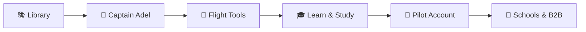
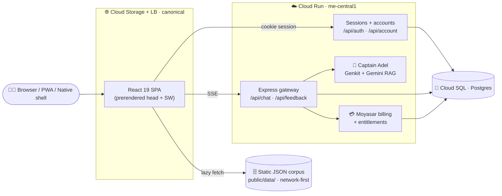

<!-- ════════════════════════════════════════════════════════════════════ -->
<!--  HERO / BRANDING                                                       -->
<!-- ════════════════════════════════════════════════════════════════════ -->

<div align="center">


# ✈️ Fly GACA

### The independent flight deck for Saudi civil aviation

**_find it · study it · always verify against GACA_**

<!-- Status badges -->
<p align="center">
  <a href="https://github.com/FlyGACA/FlyGACA-app/actions/workflows/ci.yml">
    
  </a>
  <a href="https://github.com/FlyGACA/FlyGACA-app/releases">
    
  </a>
  <a href="LICENSE">
    
  </a>
  <a href="https://flygaca.com">
    
  </a>
</p>

<!-- Tech stack pills -->
<p align="center">
  
  
  
  
  
  
</p>

<!-- Quick links -->
<p align="center" style="margin-top: 1.5rem;">
  <a href="https://flygaca.com" style="color: #2d6e8a; text-decoration: none; font-weight: 600;"><b>🌐 Live app</b></a>
  &nbsp;·&nbsp;
  <a href="#-get-started-in-60-seconds" style="color: #2d6e8a; text-decoration: none; font-weight: 600;"><b>⚡ Quick start</b></a>
  &nbsp;·&nbsp;
  <a href="#-architecture--tech-stack" style="color: #2d6e8a; text-decoration: none; font-weight: 600;"><b>🏗️ Architecture</b></a>
  &nbsp;·&nbsp;
  <a href="#-contribute" style="color: #2d6e8a; text-decoration: none; font-weight: 600;"><b>🤝 Contribute</b></a>
</p>

<br />


</div>

> [!IMPORTANT]
> **Not affiliated with GACA.** Fly GACA helps you *find and study* regulation — it never replaces it. Every answer cites the exact Part/section, and every surface reinforces one rule: **verify against the latest official GACA publication.**

---

<div align="center">

## 📑 Table of Contents

[About](#-about-the-project) · [Features](#-key-features) · [Overview](#-a-look-inside) · [App Family](#-exam-prep-app-family) · [Quick Start](#-get-started-in-60-seconds) · [Architecture](#-architecture--tech-stack) · [Deploy](#-deploy) · [Contribute](#-contribute) · [License](#-license) · [Contact](#-contact)

</div>

---

## ✨ 2026 Snapshot

<div align="center">


</div>



---

## 🎯 About the Project

**Fly GACA** is a bilingual (EN ⇄ AR), RTL-native open regulatory library and educational platform for the Saudi general-aviation community. It turns the dense world of **GACAR** (General Authority of Civil Aviation Regulations) into something accessible, searchable, and genuinely reliable.

This repository is the modern rebuild — a strict-TypeScript **React 19 + Vite 8** frontend plus its **Cloud Run** backend. Together they ship a blazing-fast, offline-capable Progressive Web App (and native iOS/Android shells via Capacitor) that puts the full regulatory corpus, **55+ aviation calculators**, and **Captain Adel** — a citation-first Retrieval-Augmented AI instructor — in the palm of your hand.

> [!NOTE]
> The backend (`server/`) is an Express + Genkit service on **Cloud Run**, backed by **Cloud SQL (Postgres)**. It owns sessions and accounts, proxies `/api/chat` to Captain Adel's RAG flow (Gemini), and handles Moyasar billing. The heavy regulatory corpus streams at runtime as static JSON under `public/data/`, so the JS bundle stays feather-light.

---

## 🚀 Key Features

Everything below is built to accelerate study, sharpen flight planning, and democratize access to aviation regulation.

| Feature | What you get |
| :--- | :--- |
| 📚 **Open GACAR Library** | The full regulatory corpus, streamed at runtime — never bundled, always fast. |
| 🤖 **Captain Adel AI** | Ask anything; get **citation-first** answers grounded entirely in official regulation. |
| 🧮 **55 Flight Tools** | Crosswind, density altitude, weight & balance, and more — shareable, URL-stateful, unit-tested math. |
| 🌦️ **Weather & Ops** | Decode METARs/TAFs, parse NOTAMs, and track the current AIRAC cycle at a glance. |
| 🗺️ **Charts & Airspace** | Interactive Leaflet maps loaded with Saudi aerodrome and approach-chart data. |
| 🎓 **Learn Hub & Exam Prep** | `/learn` is the canonical study hub — guides, spaced-repetition flashcards, timed mock exams, ground school, learning paths, and per-certificate [exam-prep packs](#-exam-prep-app-family) (PPL · CPL · IR · ATPL · …). |
| 👤 **Pilot Account Area** | Sign in for a personal dashboard, currency/recency tracking, a digital logbook, saved records, and settings — synced across devices. |
| 🏫 **Pricing, Schools & B2B** | A free core library with a Pro upgrade, a flight-school directory, and an org-admin cohort dashboard for schools tracking student exam readiness. |
| 🌍 **Bilingual & RTL** | Instant EN ⇄ AR switching; CSS logical properties mirror the whole UI automatically. |
| 📲 **PWA & Native** | Install offline via Workbox, or ship first-class iOS/Android shells with Capacitor. |

---

## 📸 A Look Inside

<table style="border-collapse: collapse;">
  <tr>
    <td width="50%" align="center" style="padding: 1rem;">
      <a href="https://flygaca.com/chat" style="text-decoration: none;">
        
      </a>
      <br /><sub><b style="color: #2d6e8a;">🤖 Captain Adel</b><br />citation-first AI instructor</sub>
    </td>
    <td width="50%" align="center" style="padding: 1rem;">
      <a href="https://flygaca.com/tools/crosswind" style="text-decoration: none;">
        
      </a>
      <br /><sub><b style="color: #2d6e8a;">🧮 Flight tools</b><br />shareable, URL-stateful math</sub>
    </td>
  </tr>
  <tr>
    <td width="50%" align="center" style="padding: 1rem;">
      <a href="https://flygaca.com/ar" style="text-decoration: none;">
        
      </a>
      <br /><sub><b style="color: #8fc9a8;">🌍 Bilingual & RTL</b><br />fully mirrored Arabic</sub>
    </td>
    <td width="50%" align="center" style="padding: 1rem;">
      <a href="https://flygaca.com/pricing" style="text-decoration: none;">
        
      </a>
      <br /><sub><b style="color: #8fc9a8;">💳 Pricing</b><br />free core library, Pro upgrade</sub>
    </td>
  </tr>
  <tr>
    <td width="50%" align="center" style="padding: 1rem;">
      
      <br /><sub><b style="color: #2d6e8a;">👋 First-visit tour</b><br />onboarding for new pilots</sub>
    </td>
    <td width="50%" align="center" style="padding: 1rem;">
      
      <br /><sub><b style="color: #8fc9a8;">📱 Mobile navigation</b><br />the full app in your pocket</sub>
    </td>
  </tr>
</table>

<div align="center"><sub style="color: #666;">Screenshots from the live app — explore it at <a href="https://flygaca.com" style="color: #2d6e8a;">flygaca.com</a>.</sub></div>

---

## 🧭 Experience Lanes

<table style="border-collapse: collapse;">
  <tr>
    <td width="33.33%" align="center" style="padding: 1rem;">
      <a href="https://flygaca.com/library" style="text-decoration: none;">
        
      </a>
      <br /><sub><b style="color: #2d6e8a;">📚 Library lane</b><br />find Parts, sections, and references fast</sub>
    </td>
    <td width="33.33%" align="center" style="padding: 1rem;">
      <a href="https://flygaca.com/learn" style="text-decoration: none;">
        
      </a>
      <br /><sub><b style="color: #8fc9a8;">🎓 Study lane</b><br />guides, packs, flashcards, mock exams</sub>
    </td>
    <td width="33.33%" align="center" style="padding: 1rem;">
      <a href="https://flygaca.com/dashboard" style="text-decoration: none;">
        
      </a>
      <br /><sub><b style="color: #2d6e8a;">🚀 Growth lane</b><br />account, pricing, schools, and progression</sub>
    </td>
  </tr>
</table>

---

## 🎓 Exam-Prep App Family

Beyond the main app, Fly GACA ships an **ASA-Prepware-style family of focused study apps** — *one GACA certificate = one app*. Each is a slice of the same shared corpus (quiz banks, flashcards, timed mock exam, mastery tracking) delivered two ways from **this one monorepo**:

- 🌐 **Web** — a live pack page at `flygaca.com/study/packs/<id>`.
- 📱 **Native iOS** — a SwiftUI target in [`apple/`](apple/ARCHITECTURE.md) (`com.flygaca.<id>`), paid one-time and sold together as an App Store bundle.

| App | Certificate / rating | Primary GACAR source | Status |
| :--- | :--- | :--- | :--- |
| **PPL** | Private Pilot Licence | Parts 61 · 91 · 71 · 67 + Saudi AIP | ✅ Live |
| **ELPT** | English Language Proficiency (SAELPT) | ICAO LPR (Fly GACA authored) | ✅ Live |
| **AIP** | Aeronautical Information | SANS Saudi AIP (GEN/ENR) | ✅ Live |
| **CPL** | Commercial Pilot Licence | Parts 61 · 91 · 119 · 135 | 🆕 New — draft content |
| **IR** | Instrument Rating | Parts 61 · 91 · 97 + AIP ENR | 🆕 New — draft content |
| **ATPL** | Airline Transport Pilot Licence | Parts 61 · 121 | 🆕 New — draft content |
| **Wave 3** | Flight Instructor · Dispatcher · AME · UAS · … | per-certificate GACAR | 🔜 Roadmap |

> [!IMPORTANT]
> **Sources: GACA · SANS · Fly GACA — only.** Every app is grounded in GACA (GACAR regulations, Advisory Circulars, the GACARs eBook), SANS (the Saudi AIP), and Fly-GACA-authored practice material — enforced mechanically by [`tests/pack-sources.test.ts`](tests/pack-sources.test.ts). The CPL/IR/ATPL question banks are **draft pending human review** (see [`docs/STUDY-CONTENT-REVIEW.md`](docs/STUDY-CONTENT-REVIEW.md)); practice questions are Fly-GACA authored and are **not** real GACA exam questions.

<div align="center"><sub style="color: #666;">The full lineup, waves, App Store bundle and Android plan live in <a href="docs/APPS-FAMILY-ROADMAP.md" style="color: #2d6e8a;">docs/APPS-FAMILY-ROADMAP.md</a>.</sub></div>

---

## ⚡ Get Started in 60 Seconds

Get a local dev environment running in under a minute.

### Prerequisites

- **Node.js** `20` (matches CI)
- **npm** `>= 10`

### Quick Start

```bash
# 1. Clone the repository
git clone https://github.com/FlyGACA/FlyGACA-app.git
cd FlyGACA-app

# 2. Install dependencies
npm install

# 3. (Optional) Configure your local environment
cp .env.example .env.local

# 4. Launch the dev server
npm run dev
```

Open **`http://localhost:5173`** and you're flying. 🛫

> [!TIP]
> Without `VITE_API_BASE_URL` set, the app runs **local-first** — the corpus, tools, and ground school all work offline; only backend features like accounts, sync and Captain Adel AI stay dark until you point it at a deployed API.

---

## 🏗️ Architecture & Tech Stack

Engineered for performance, offline reliability, and strict type safety.



<table style="border-collapse: collapse; width: 100%; margin-top: 1rem;">
<tr style="background: linear-gradient(90deg, rgba(45, 110, 138, 0.05), rgba(143, 201, 168, 0.05));">
  <td width="50%" style="padding: 1.5rem; border-left: 4px solid #2d6e8a;">

**Frontend**
- ⚛️ React 19 · Vite 8 · TypeScript (strict)
- 🧭 `react-router` — single route table
- 🎨 CSS Modules + design tokens (logical properties)
- 🌐 i18next — bilingual EN/AR with RTL mirroring
- 📦 `vite-plugin-pwa` (Workbox) service worker

  </td><td width="50%" style="padding: 1.5rem; border-right: 4px solid #8fc9a8;">

**Backend & Native**
- ☁️ Cloud Run (Express) · `me-central1`
- 🐘 Cloud SQL Postgres · own JWT-cookie sessions
- 🧠 Genkit + Gemini RAG (Captain Adel)
- 💳 Moyasar billing & entitlements
- 📱 Capacitor iOS / Android shells
- 🗄️ Static JSON corpus streamed from `public/data/`

  </td>
</tr>
</table>

### Core Commands

> [!TIP]
> `npm run verify` chains **every** CI gate — `typecheck → lint → format:check → test → build → check:bundle`. A green local `verify` means a green CI.

```bash
npm run verify      # ⭐ Run the full CI gate before every commit
npm run typecheck   # Strict TypeScript (tsc -b --noEmit)
npm run lint        # ESLint
npm run test        # Vitest — calc correctness & i18n parity
npm run test:e2e    # Playwright — smoke & accessibility
npm run build       # Production assets → dist/
npm run preview     # Serve the production build locally
```

> [!NOTE]
> `server/` (the Cloud Run backend) is its **own npm package with its own CI gate** — root `verify` does not cover it. Touching it? Run `npm run lint && npm test && npm run build` inside `server/` too.

### Native Mobile Shells

The `ios/`/`android/` platform projects are **generated on the build machine, never committed**
(`.gitignore` excludes both) — Capacitor 8 uses Swift Package Manager, so no CocoaPods. See
[`docs/RUNBOOK-native.md`](docs/RUNBOOK-native.md) for the full setup.

```bash
npm install         # SPM references node_modules/@capacitor/* — install first
npm run build       # produce dist/ (cap copies it into the shell)
npx cap add ios     # generate ios/ (once per machine, or per flavor via npm run flavor:ios)
npx cap sync ios    # copy web assets + regenerate the SPM manifest
npm run cap:open    # open ios/App in Xcode → set signing team → run
```

---

## 🌍 Deploy

Google Cloud is **canonical** (Cloud Run + Cloud SQL, SPA on Cloud Storage behind a load balancer); Vercel, Cloudflare, and Netlify run as optional mirror fronts that proxy `/api/*`.

<div align="center">

**Deployment Platforms**

[](docs/RUNBOOK-deploy.md)
&nbsp;
[](vercel.json)
&nbsp;
[](wrangler.toml)
&nbsp;
[](netlify.toml)

</div>

```bash
# Google Cloud (canonical) — see docs/RUNBOOK-deploy.md for the full sequence
npm run build                                   # SPA → dist/
gcloud storage rsync -r dist gs://$BUCKET       # publish the SPA
npm run db:migrate                              # apply pending SQL migrations
gcloud run deploy flygaca-api --source .        # build + deploy the API

# Mirror fronts
# Vercel       vercel deploy --prod
# Cloudflare   npx wrangler deploy            # Worker + dist/ assets (wrangler.toml)
# Netlify      netlify deploy --build --prod
```

> [!NOTE]
> For provisioning a fresh GCP project, the deploy sequence, and the secrets each service needs, see `docs/RUNBOOK-deploy.md`.

---

## 🤝 Contribute

Join the mission to modernize Saudi general aviation. PRs welcome! 🛫

1. **Fork** the project and create a feature branch — `git checkout -b feature/amazing-feature`.
2. **Build** your change. Adhere to the two enforced conventions: **bilingual keys in both** `en.json` **and** `ar.json`, and **CSS logical properties only** (no hard-coded colours, no physical `left`/`right`).
3. **Verify** with `npm run verify` — this is the same gate CI runs.
4. **Commit** with a semantic message — `feat: add amazing feature`.
5. **Push** and open a Pull Request.

> [!TIP]
> Adding a tool or a guide? Register tools in `src/lib/tools.ts` (the single source of truth) and lift the math into `src/calc/`. Authoring educational content? Run `npm run new:guide` and read [`GUIDE_AUTHORING.md`](GUIDE_AUTHORING.md). New contributors should skim [`CLAUDE.md`](CLAUDE.md) for the enforced conventions and [`ROADMAP.md`](ROADMAP.md) for what's next.

---

## 📄 License

Distributed under the **MIT License**. See [`LICENSE`](LICENSE) for details.

---

## 🌐 The Fly GACA Repository Family

Fly GACA is composed of ten focused repositories. [**The Book of Fly GACA**](https://github.com/ay2m/FlyGACA/blob/main/THE-BOOK-OF-FLY-GACA.md) is the central architecture manual mapping all surfaces, data-parity contracts, and technical principles in one place.

| Repository | Role & Description |
| :--- | :--- |
| [FlyGACA/FlyGACA-app](https://github.com/FlyGACA/FlyGACA-app) (this repo) | flygaca.com — React 19 + Vite 8 PWA web app, Cloud Run + Cloud SQL backend (`me-central1`), regulatory corpus + content pipelines |
| [FlyGACA/Captain-Adel](https://github.com/FlyGACA/Captain-Adel) | Captain Adel — AI flight instructor service (`captadel.com`), RAG engine behind chat, grounding & evals |
| [ay2m/FlyGACA](https://github.com/ay2m/FlyGACA) | Native iOS app family — shared `FlyGACAKit` package + ELPT and AIP App Store targets |
| [FlyGACA/Office](https://github.com/FlyGACA/Office) | Business operating system — strategy, governance, legal, finance, KSA compliance, HR & GTM docs |
| [FlyGACA/ELPT](https://github.com/FlyGACA/ELPT) · [AIP](https://github.com/FlyGACA/AIP) | App Store metadata repos — store listing copy, localized screenshots, per-app roadmap |
| [FlyGACA/PPL](https://github.com/FlyGACA/PPL) · [CPL](https://github.com/FlyGACA/CPL) · [IR](https://github.com/FlyGACA/IR) · [ATPL](https://github.com/FlyGACA/ATPL) | App Store metadata repos for paused exam modules |

---

## 📬 Contact

| | |
| :--- | :--- |
| **Author** | Fly GACA |
| **Operator** | BDA Company International (شركة بدع الدولية) — CR 7030976893, Riyadh, Saudi Arabia |
| **GitHub** | [@FlyGACA](https://github.com/FlyGACA) |
| **Email** | [i@flygaca.com](mailto:i@flygaca.com) |
| **Support** | [support@flygaca.com](mailto:support@flygaca.com) · [flygaca.com/support](https://flygaca.com/support) |
| **Website** | [flygaca.com](https://flygaca.com) |
| **Project** | [github.com/FlyGACA/FlyGACA-app](https://github.com/FlyGACA/FlyGACA-app) |

---

<div align="center">

<br />

**Built for the Saudi GA community**

<sub style="color: #2d6e8a;">**find it · study it · always verify against GACA**</sub>

<br /><br />

<b style="color: #8fc9a8; font-size: 1.1em;">صُنع في السعودية 🇸🇦 · Made in Saudi Arabia</b>

</div>
